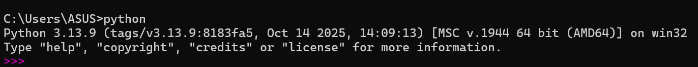
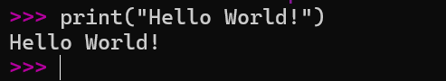
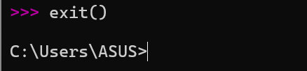
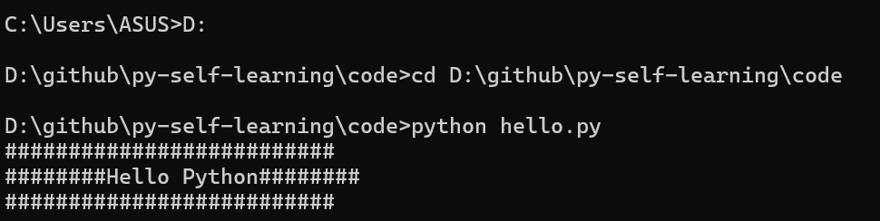
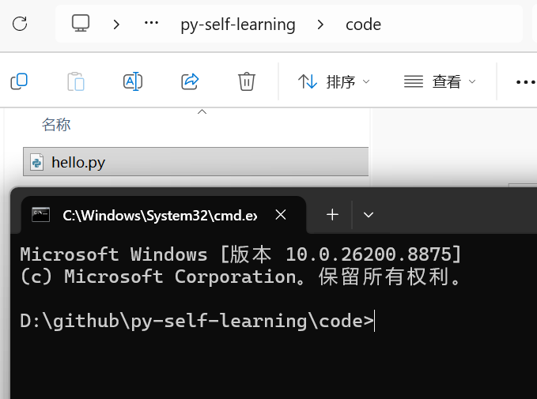

### 第一个python程序
下载安装好python后  
win+r输出cmd进入终端  
输入python 若出现版本信息说明安装成功 

接着输入第一个python程序  

输入exit（）退出到windows命令行    
*注意：命令行中所有符号需要是英文符*    
*三个粉箭头是python命令行的标识*

>>若想一次执行多行代码  
则需新建一个文本文档，命名为.py文件（例如hello.py）  
*注意：切换路径，计算机才能找到你所建的文件运行*  
方法一：在命令行切换路径后执行

方法二：在所创建文本的地址栏输入cmd

### pycharm
由于仅用python解释器效率低，且在终端写代码没有提示，故安装IDE（集成开发环境）作为开发工具  
常见的开发工具为VScode、PyCharm，之后学习使用PyCharm

*Pycharm中语句无需；*

#### 快捷键
1. CTRL+/：快速注释
2. shift+alt+。：放大字号
3. shift+alt+,:缩小字号

>>注意：  
1. python中使用";"作为语句的分隔符,使用换行作为终止符  
2. 只有你想把多条语句挤在同一行的时候，才用分号隔开不同语句。