## 数据类型
### 变量
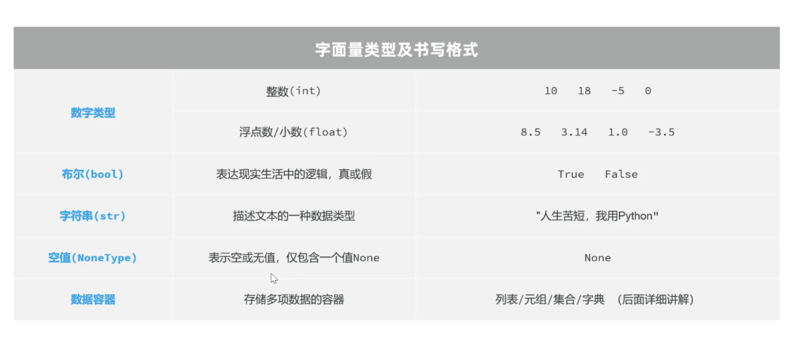  
一个变量可以存储不同类型的值  
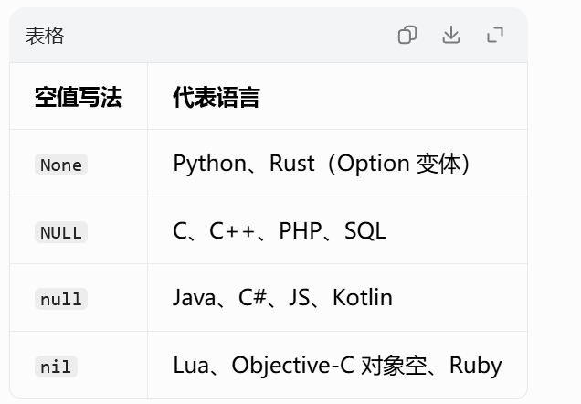

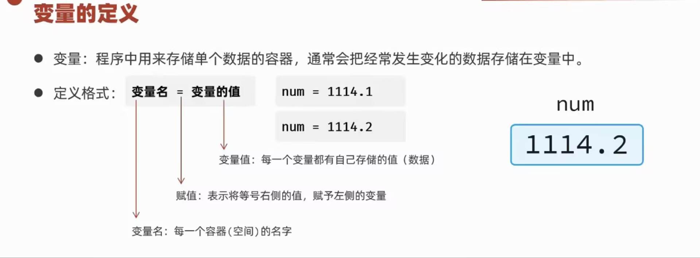

#### 变量的命名
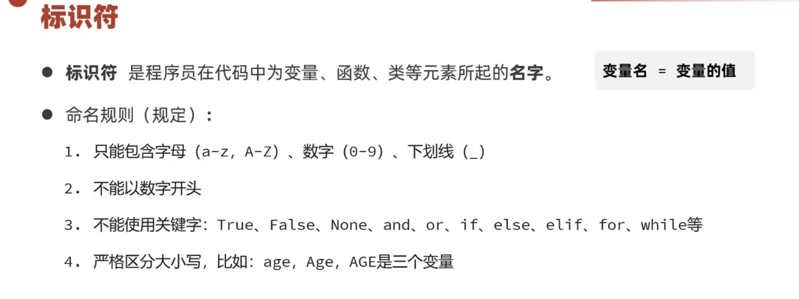
注意：
1. python大小写严格敏感  
2. 变量名用英文全小写
   
获取数据类型
1. type（）  
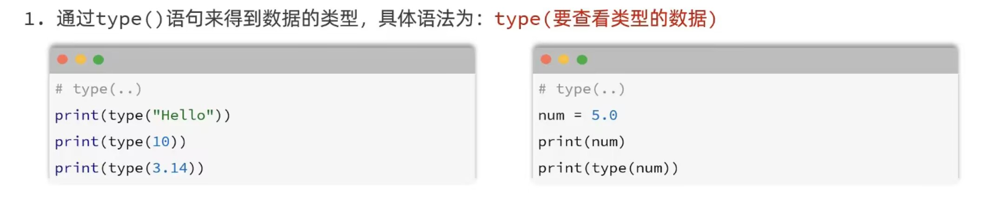  
type（变量），为查看变量中存储的数据类型  
2. isinstance（）  
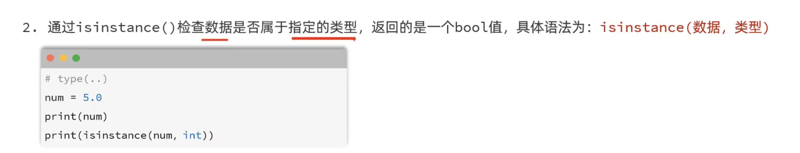

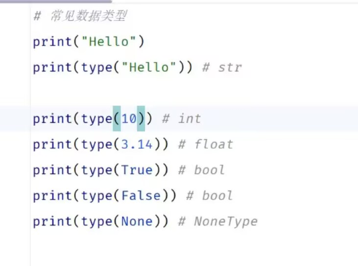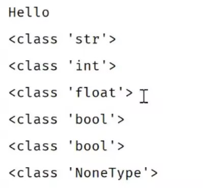  

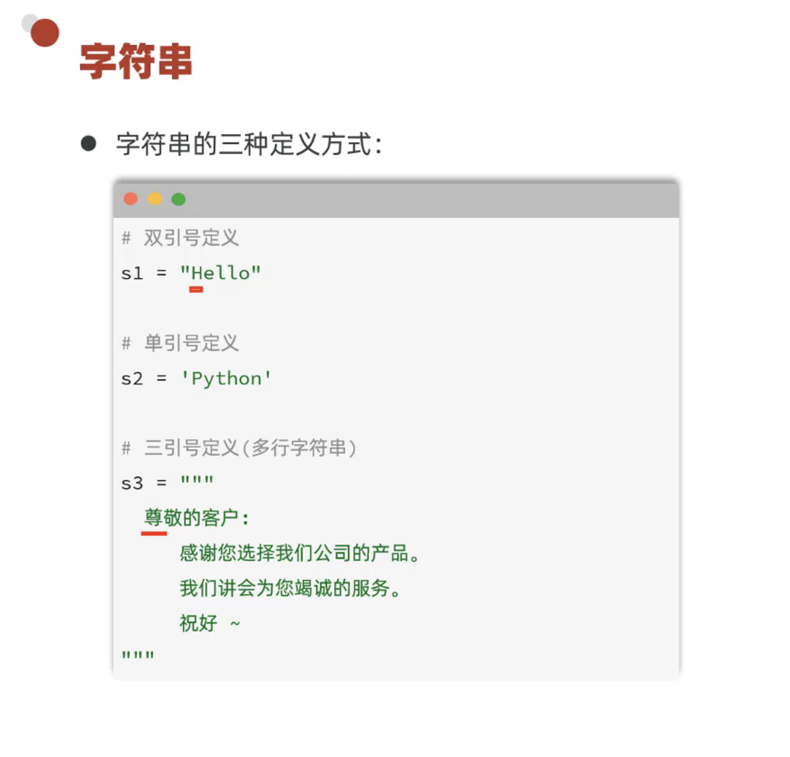  

### 字符串
  
注意：单引号和双引号定义的字符串不支持换行；三引号定义的字符串支持换行  
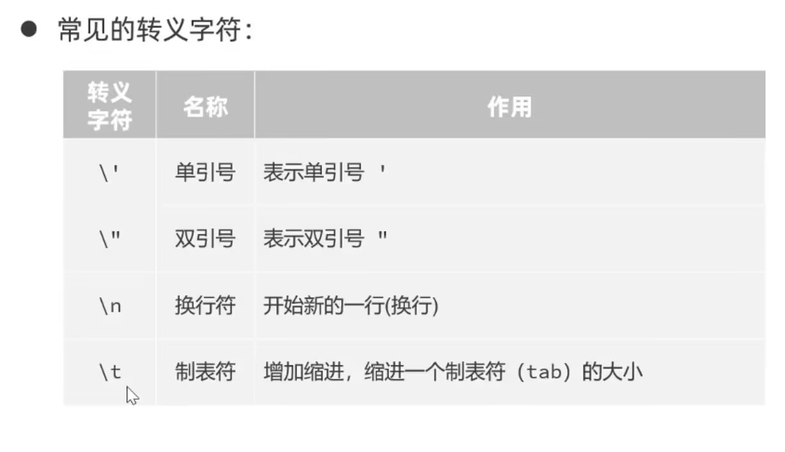

#### 字符串拼接
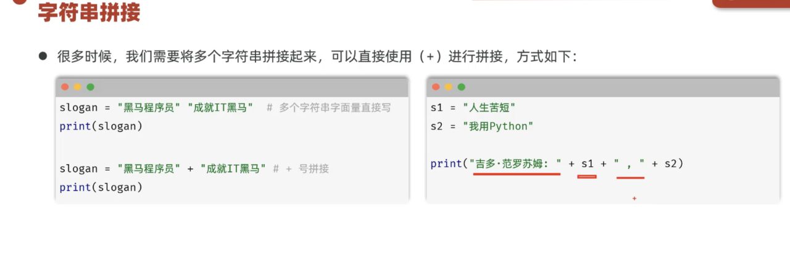  
注意：同为字符串才能拼接，其他数据类型需先转为字符串类型才能拼接  
-->利用str（其他类型变量），可以将其他类型数据转为字符串类型  
*补充：强制类型转换*  
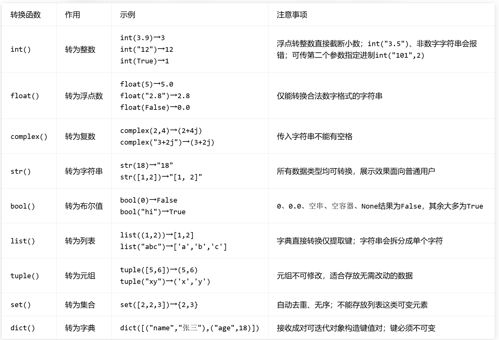

#### 字符串格式化
1. 方式一
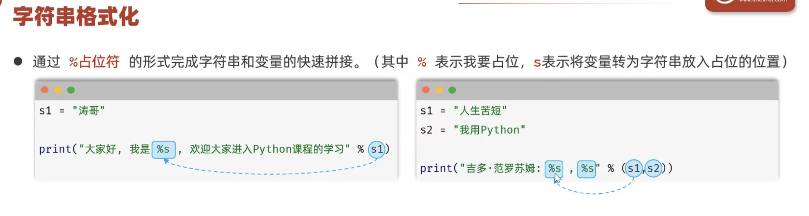  
注意：前后字符串数量保持一致  
2. 方式二
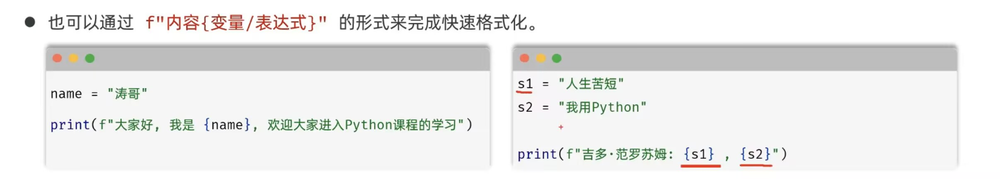  

### 输入与输出
input输入 print输出  
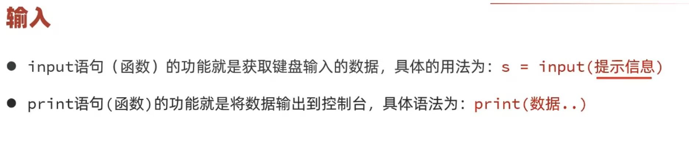  
注意：无论键盘输入的是什么类型的数据，获取到的数据永远是字符串类型  

### 运算符
#### 算术运算符  
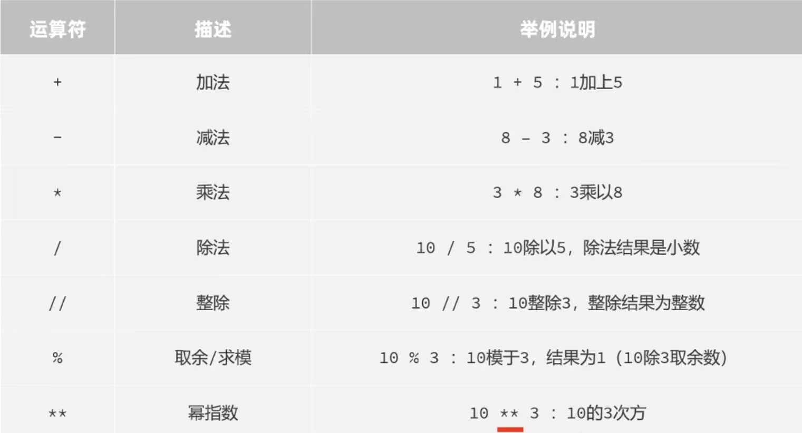  
注意：
1. 算数运算符的优先级** -> * / // % -> +-  
2. 由于计算机内数据采用二进制存储，故计算时可能会出现精度损失

#### 赋值运算符
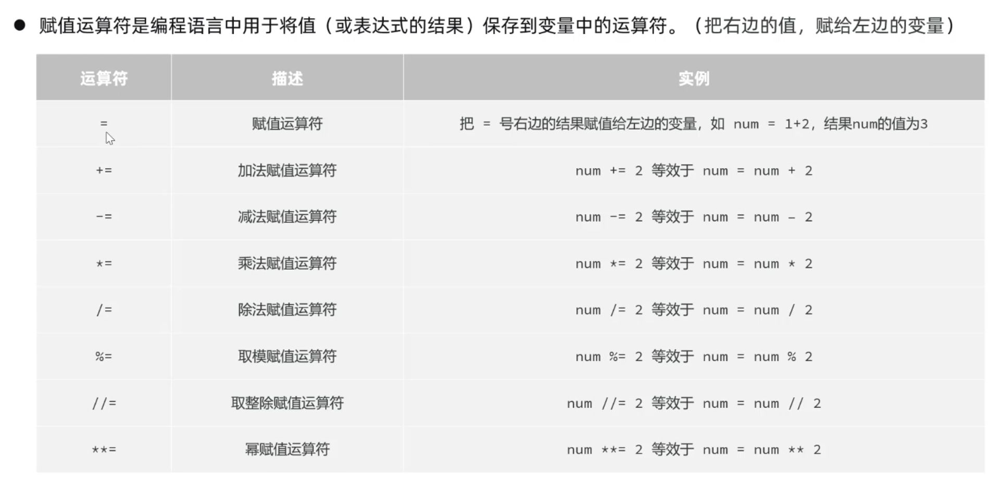  

#### 比较运算符
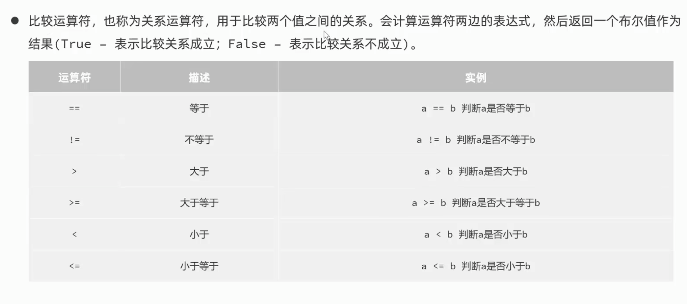  

#### 逻辑运算符
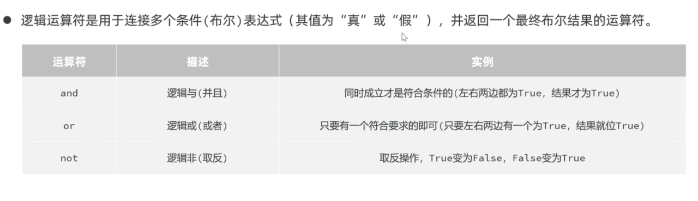  

