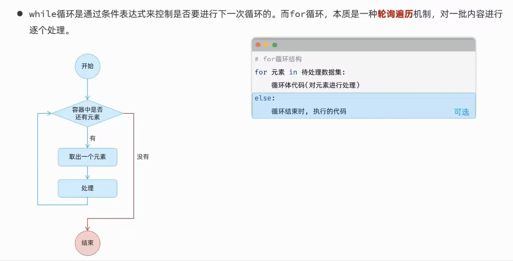
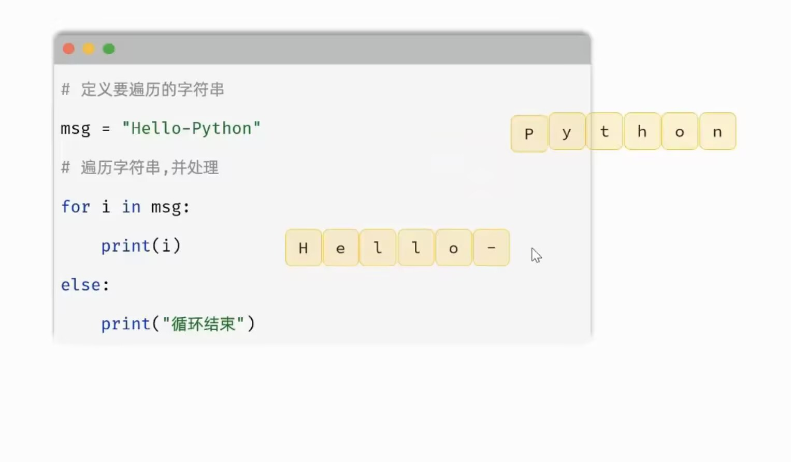
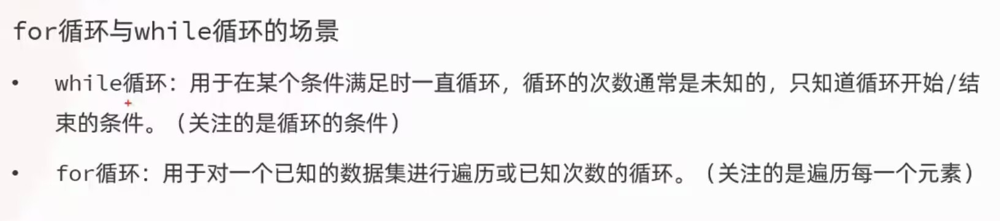
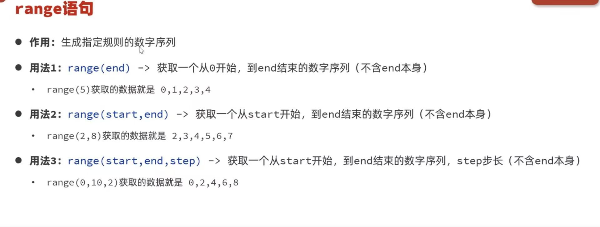
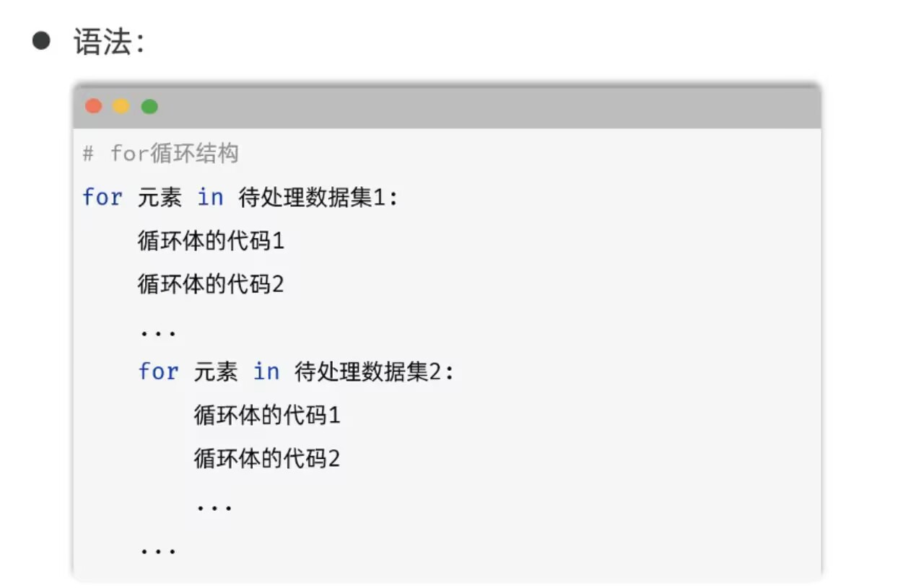

## 流程控制语句
### 条件判断
  
注意：
1. Python中通过缩进来描述代码归属，，归属于if代码块的语句，需要在前方缩进四个空格。  
2. 同一个代码块下的语句缩进空格数需相同。

  
  

### 模式匹配
  ，用于维持

注意：
1. case _匹配其他输入  
2. pass为空语句，起占位作用，为了维持语法完整使用  

进阶case+if
```python
data = ("tom", 22)
match data:
    case (name, num) if num > 18 and len(name) >2:
//case 变量|常量 if布尔表达式：只有满足if条件+匹配同时满足才进case
//data是元组，case（name，num）这一步叫做解构（解包）
        print(f"匹配成功：{name},{num}")
    case _:
        print("不匹配")
```

### 循环
#### while循环
  
条件表达式成立就执行循环语句，执行完毕后再次判断条件表达式是否成立。流程如下  
  
while-else结构：  
  
*else部分可有可无*  

#### for循环  

  
  
*注意：*
*1.for i in msg:这一条语句就创建出了i这个变量*  
*2.for循环的遍历顺序由in后面的容器决定*

##### for循环与while循环
  

##### range语句——生成想要的数据集
  

#### 嵌套循环
  
*tips：无论光标在哪 想要快速换行可以shift+enter*
注意：print语句自带换行效果，每一次输出占一行，若不想换行使用print("输出内容",end=" ")，其中end表示的是每一次输出以什么结束；若无end默认以\n结束，表示换行。

**注意：空字符串为""里面不能含有空格。**  

##### 循环关键字
break：只能出现在循环中，表示结束或者跳出循环。  
continue：跳过本次循环剩下的代码，直接进入下一轮循环  